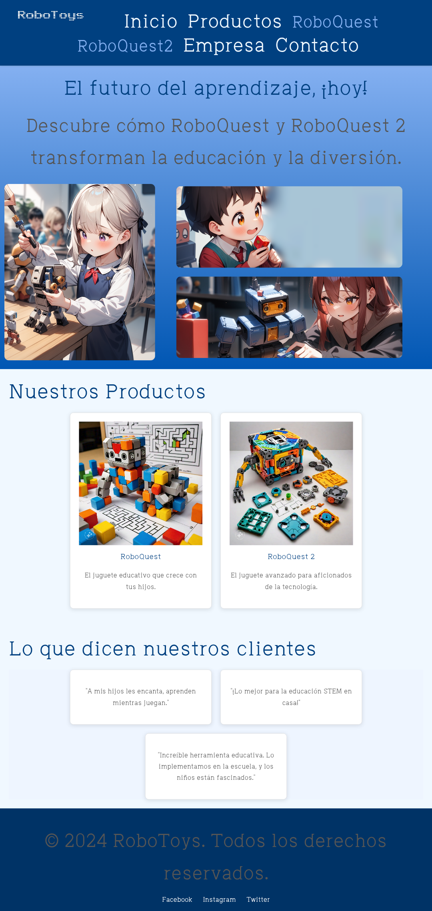
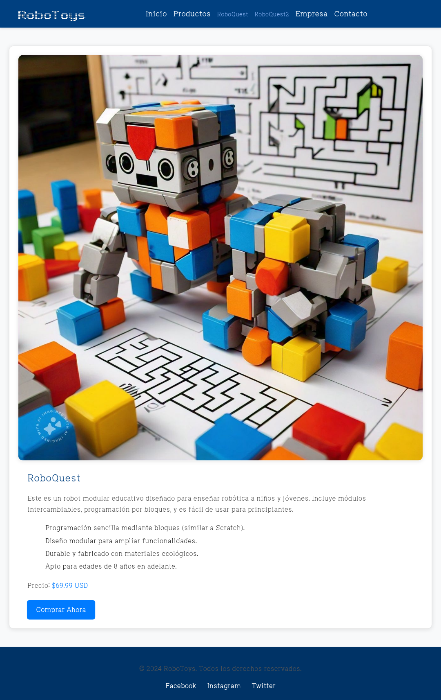
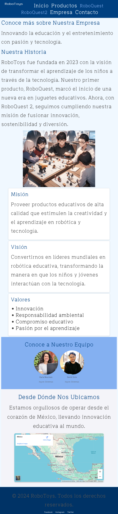
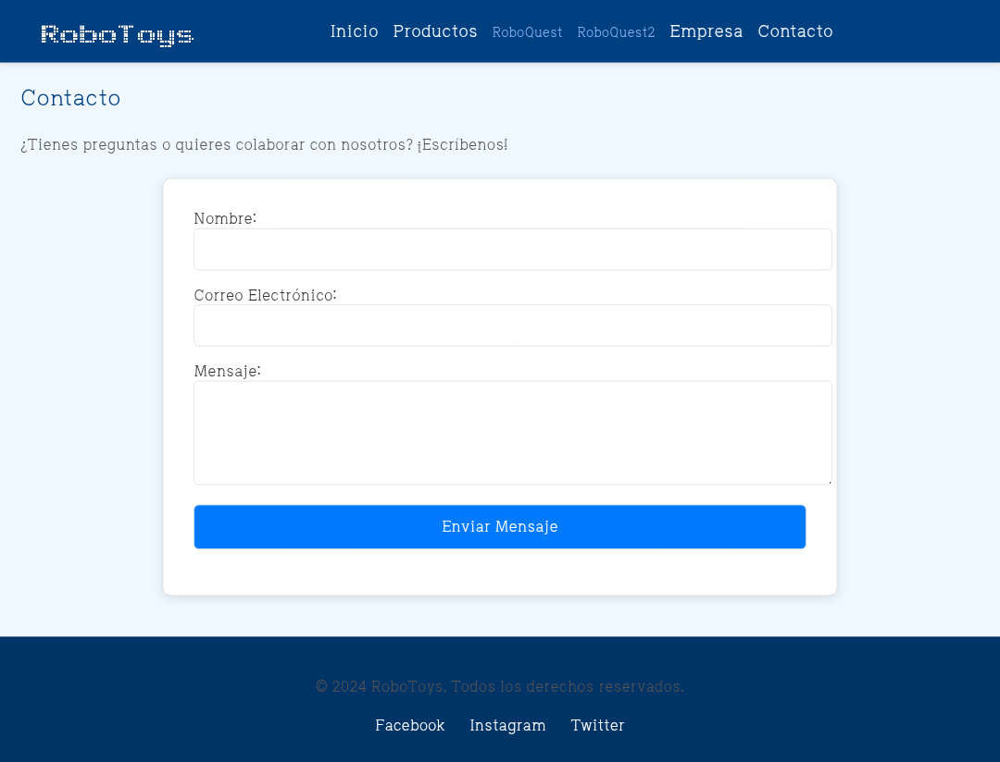

# RoboQuest2 – Educational Toy Website

This is a static website designed to present "RoboQuest2", an innovative educational toy. The site was developed as a university project for two courses: Web Programming and Business Culture.

Built using:
- HTML5 & CSS3
- No JavaScript
- Responsive design (Flexbox & Grid)
- Semantic HTML & accessibility

## 🌐 GitHub Pages

You can visit the live site here:  
🔗 https://ka7suk0.github.io/RoboQuest-Website/index.html

## 📸 Screenshots

### Homepage

### Products

### Company

### Contact

---

© 2024 - Project created for academic purposes.
